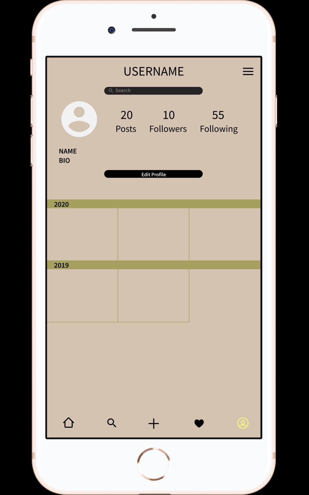
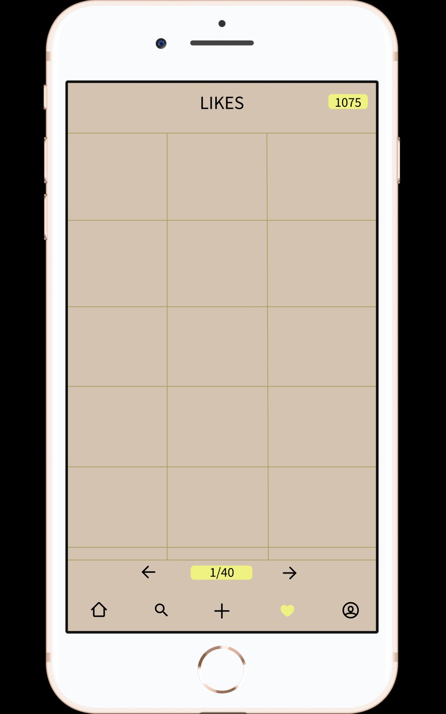
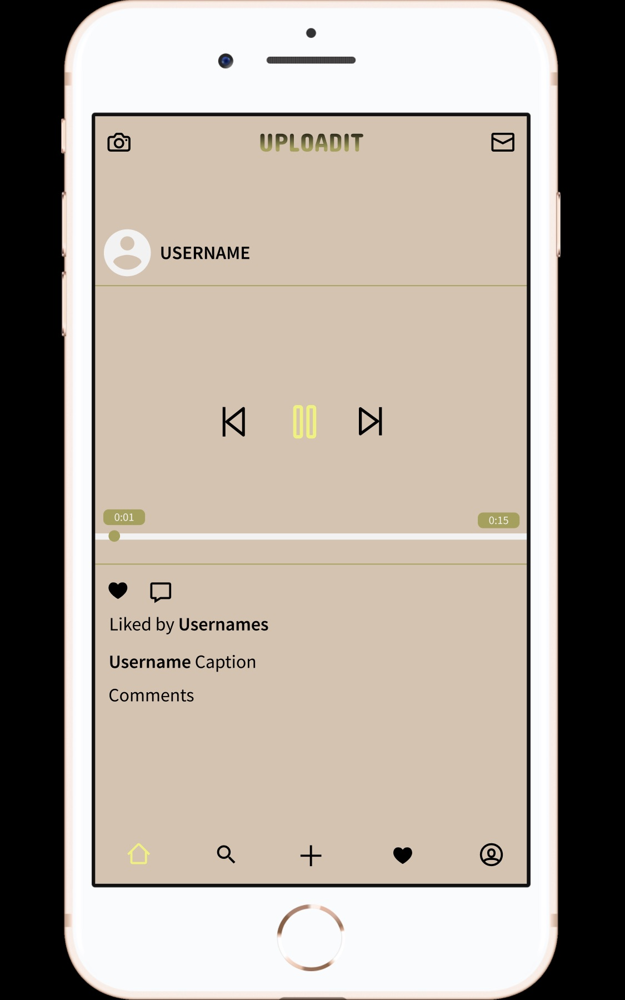
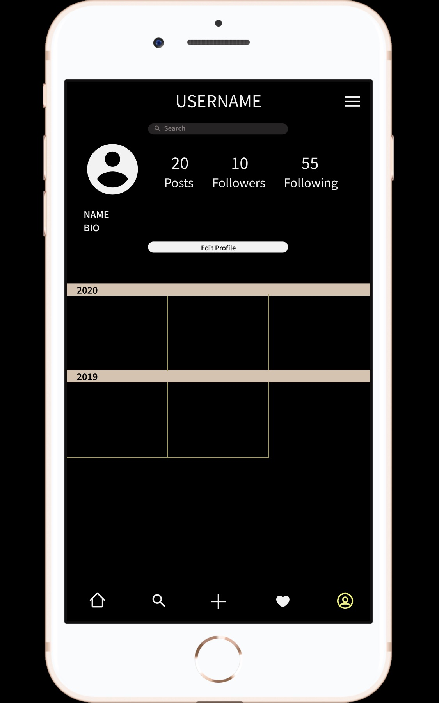
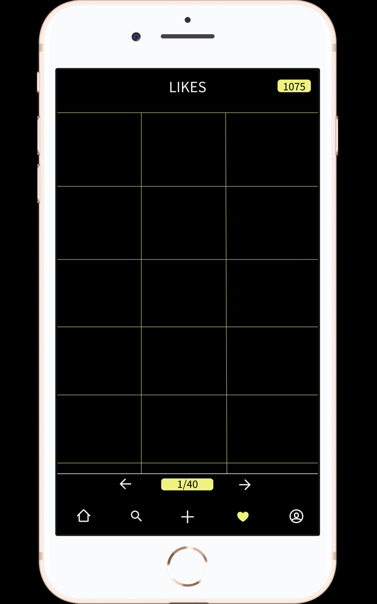
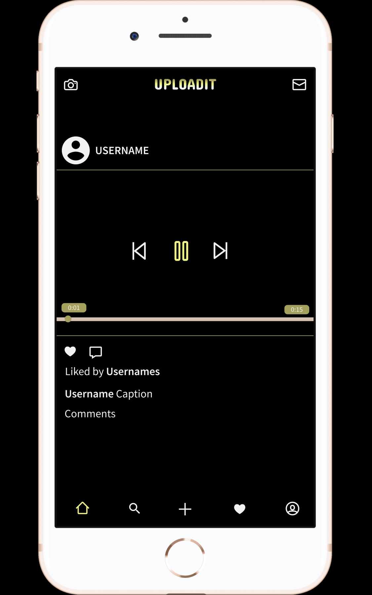

# High-Fidelity Prototype
### DH 150 Assignment 8 by Kimberly Jimenez

---
### Project Description 

UPLOADIT is a photo sharing, social media site that allows for more user control and accessibility to key features of the app. The purpose of the prototyping phase, from low to high fidelity, is to gauge what needs to be changed in the process according to feedback and observation. For example, I noted in the low-fidelity prototype reflection, the search bar on the Profile page was inaccessible because it required a user to pull the screen down. Thus, I decided to place it on the Profile page itself to make it automatically accessible, rather than manually accessible. Updating key features according to users, I believe, is important to the process of prototyping. 

---
### Tasks Supported

Currently, the UPLOADIT high-fidelity prototype supports four tasks. The first: a Profile page with images categorized by years. The second: a search bar on Profile page to search for images by month and/or year. The third: an immediately accessible Likes page, with number of Likes and Likes pages displayed. The fourth: a video player with a play, pause, forward, rewind, and scrubber buttons as well as a time marker. 

---
### Graphic Design Decicion Making

I based my first design off of Instagram, when the app is in dark mode. However, I immediately noticed the lack of color or vibrancy. Thus, I decided to create an "original version" of the application using the brighter colors of my palette as a base foundation. I wanted the opening screen to come across as sleek, so the logo and name of the app are minimalistic—as are most of the screens included. As for the Profile page, I added two distinct features (search bar and year tabs) to allow for user accessibility to specific images. At first, the year tabs were very small to display a minimalistic design; however, I found the size of the font required for them was illegible, so I decided to increase the size of the tabs. The search bar is based off Dark Mode search bars (and is the same across my two versions of the application), similar to Instagram and Tumblr. Furthermore, I decided it would be important for the icon to be highlighted when the user is exploring its respective page—I based this graphic feature off of Twitter. As for the color scheme I used, it was extracted from [this](https://www.behance.net/gallery/81668019/Black-Sheep-White-Light) website. I found the colors to be soothing and visually pleasing.

Although the accessibility score is low, I did note whether the colors I chose had sufficient contast, which is reflected in the audit it passed.

After revising the prototype to have more color, the audit remains the same and passes color contrast.

---
### Representative Screens

   

Dark Mode

  

---
### Full Interaction Sequence

Arrow Sequence

Dark Mode

Arrow Sequence

---
### Prototype

Click [here](https://kj121497.github.io/assignment8/) to view the prototype. Click [here](https://kj121497.github.io/assignment8/index2.html) to view the prototype in dark mode.

Click [here](https://www.figma.com/proto/GrhctrA6nZANz2fAeeZ4VU/High-Fidelity-Prototype-(DH-150)?node-id=6%3A4&scaling=scale-down) to interact with the prototype. Click [here](https://www.figma.com/proto/uKlJtPJhNTEL4bYMT2T1AT/High-Fidelity-Prototype-(DH-150)-(Copy)?node-id=6%3A4&scaling=scale-down) to interact with the prototype in dark mode. 
